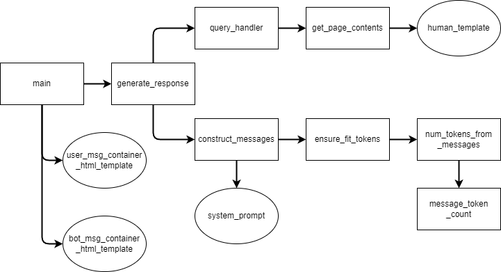

# EconMentor

EconMentor is a chatbot web application based on the GPT-4 LLM created by OpenAI. In its current version, it uses a vector base hosted in Pinecone that contains abstracts and metadata from licensing thesis published in the Social Sciences faculty of the Pontifical Catholic University of Peru (PUCP). Its goal is to aid prospective thesis writers in the ideation of new research topics.

The following figure is a map of the different functions that make up EconMentor:

The core function is `generate_response`, which handles the query and constructs the chain of messages to be fed to the model. It relies on two functions: first, `query_handler` performs a semantic search of the original user query through Maximum Marginal Relevance (MMR) to find documents that score highest in terms of relevance and diversity ([Carbonell and Goldstein, 1998](https://dl.acm.org/doi/10.1145/290941.291025)). Then, `get_page_contents` parses the text and metadata of the found abstracts into a singular string. This string is then assigned as one values of a dictionary, the other being the the role indicator, in this case `"user"`, as it contains the query and context provided to answer it. Second, `construct_messages` generates the chain of messages to be processed by the model. This step is helpful as the GPT-4 API is, by default, best suited for chat completion; this means that it takes as context an initial system prompt and further messages both from the assitant itself and the from user querying the model. This function mainly parses all the dictionaries, which contain each message and the role of the sender of the message, into a list, all while assuring that the total number of tokens derived from the text is within the limits of what the model can handle (4096). Finally, `generate_response` sends the API request and obtains the response, which is then included the form of an HTML block to be displayed in the webpage created through the `streamlit` library. This latter library handles the creation and customization of a container through which a chatbot webapp can be displayed and deployed.